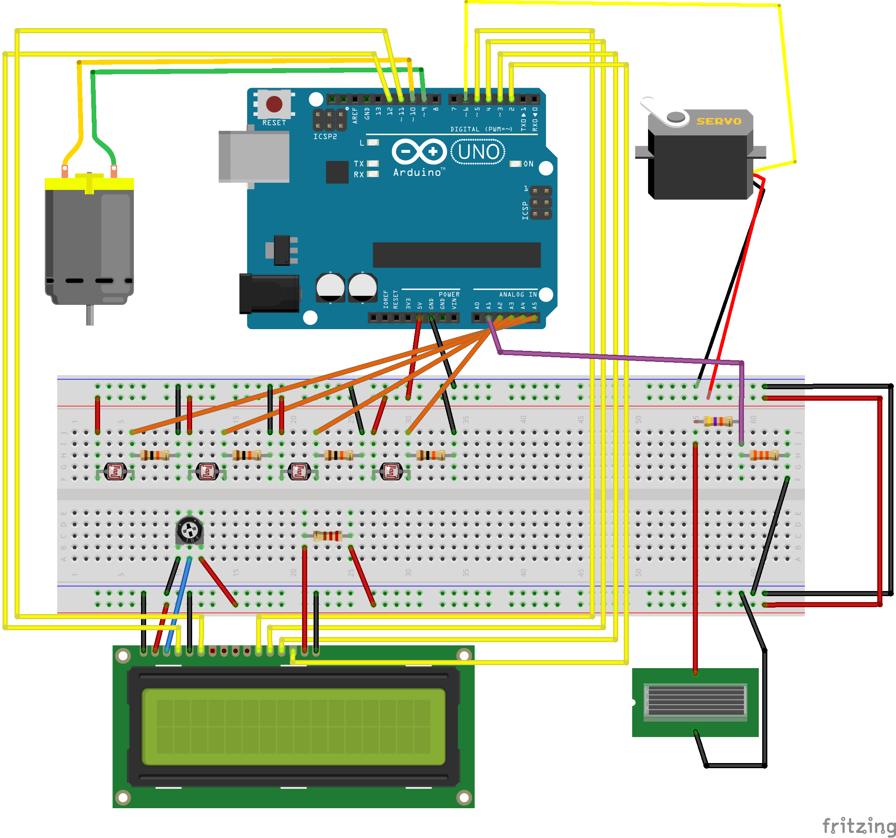

# Solar Tracker Arduino Project

## About

Me and three other students built a solar tracking machine as a school project. We designed and made everything by ourselves (3D-models etc.). This was first ever Arduino project for me and my group members. In the end we got it to work!

## Operation

This machine turns its solar panel towards to the greatest source of light. It figures out the direction by measuring voltages across 4 different light dependent resistors (LDR). In the back Arduino calculates differences between these voltage values and turns first vertical axis and then horizontal. The machine turns vertical axis with a Servo-motor and the horizontal with a DC-motor.

The solar tracking machine needs external battery source in order to work.

## Circuit

Breadboard view of the projects electric circuit:
Circuit is missing L9110S DC-Motor controller because it was not found in the circuit software.

## Components

* 1 x Arduino Uno
* 1 x Solar Panel
* 4 x LDR (Light Dependent Resistor)
* 1 x 16x2 LCD
* 1 x DC-Motor
* 1 x Servo
* 4 x 10kΩ Resistors
* 1 x 220Ω Resistor
* 1 x 10kΩ Potentiometer
* 1 x basic switch
* 6 x 1.2V NiMH Rechargeable batteries
* Various 3D-Printed parts (models can be found in "OpenSCAD"-folder)

Voltage divider:

* 1 x 33kΩ Resistor
* 1 x 47kΩ Resistor